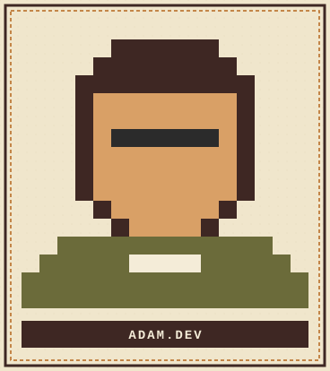

<p align="center">
  
</p>

<p align="center">
  
</p>

<p align="center">
  <a href="https://www.linkedin.com/in/adam-hidayatullah-b25a87195" target="_blank">
    
  </a>
  <a href="https://portofolioadam.xyz" target="_blank">
    
  </a>
  <a href="mailto:adamnoer62@gmail.com">
    
  </a>
</p>

<p align="center">
  
</p>

## ❦ Tentang Saya

Fullstack Developer & Engineering Deputy Lead dengan **5+ tahun pengalaman** membangun sistem end-to-end yang scalable dan user-centric. Berpengalaman memimpin tim cross-functional, merancang arsitektur enterprise-grade, dan mengoptimalkan SDLC untuk mempercepat siklus deployment tanpa mengorbankan stabilitas sistem.

Saat ini fokus mengembangkan produk berbasis **AI/Computer Vision** — mulai dari Virtual Try-On untuk produk luxury watches, sistem deteksi cacat produk berbasis YOLO, hingga fitur AI-integrated pada ERP internal menggunakan LLM open-source yang di-fine-tune sendiri.

```
> whoami
Adam Noer Hidayatulloh — Jonggol, Bogor, West Java

> current_focus
["Virtual Try-On Tool", "AI-Integrated ERP System"] @ Wrapstation

> currently_learning
Computer Vision · LLM Fine-Tuning · AI-driven Product Architecture

> status
Open for collaboration on web development & applied AI projects
```

<p align="center">
  
</p>

## ❦ Perkakas & Teknologi

**Front-End**
<p>
  
  
  
  
  
  
</p>

**Back-End**
<p>
  
  
  
  
</p>

**AI / Machine Learning**
<p>
  
  
  
  
</p>

**DevOps & Tools**
<p>
  
  
  
  
  
  
</p>

<p align="center">
  
</p>

## ❦ Rekam Jejak

<table>
<tr><th align="left">Peran</th><th align="left">Perusahaan</th><th align="left">Periode</th></tr>
<tr><td>Fullstack Developer</td><td>Wrapstation</td><td>May 2026 – Present</td></tr>
<tr><td>Senior Fullstack Developer & Deputy Leader</td><td>PT Bizera Digital Indonesia</td><td>Jun 2025 – Mar 2026</td></tr>
<tr><td>Senior Software Engineer</td><td>PT Vaganza Solusi Internasional</td><td>Mar 2022 – Apr 2025</td></tr>
<tr><td>Fullstack Web Developer</td><td>Bima Global Study</td><td>Oct 2024 – Mar 2025</td></tr>
<tr><td>Fullstack Developer (Freelance)</td><td>Freelancer</td><td>Apr 2021 – Present</td></tr>
</table>

> 🏆 Menjaga **99.9% system uptime** pada aplikasi web berskala enterprise sambil memimpin tim cross-functional dan merancang arsitektur RESTful/GraphQL yang scalable.

<p align="center">
  
</p>

## ❦ Mari Terhubung

<p align="center">
  📱 0822-9793-0060 &nbsp;|&nbsp; 📧 adamnoer62@gmail.com &nbsp;|&nbsp; 🌐 <a href="https://portofolioadam.xyz">portofolioadam.xyz</a>
</p>

<p align="center"><i>"Building scalable systems, one commit at a time."</i></p>

<p align="center">
  
</p>
